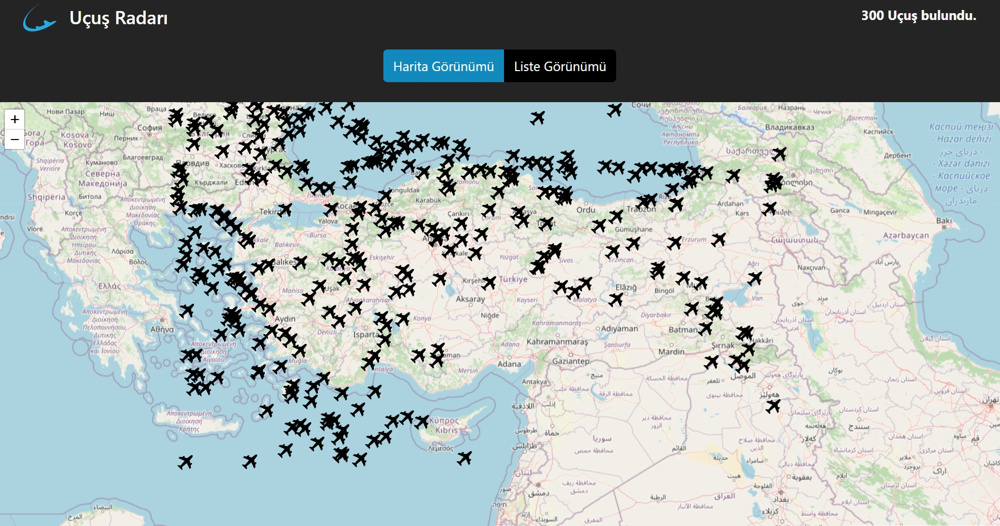

## React_Radar_App

With the Radar Application, created using React libraries and compatible with every screen, users can view flight details, status, and route on the map, as well as access detailed information about the aircraft.

# Tools and Libraries Used

-react-redux,
-@reduxjs/toolkit,
-react-leaflet
-react-paginate
-axios
-bootstrap

# API

- https://rapidapi.com/apidojo/api/flight-radar1

# Screenshots

# Gif

